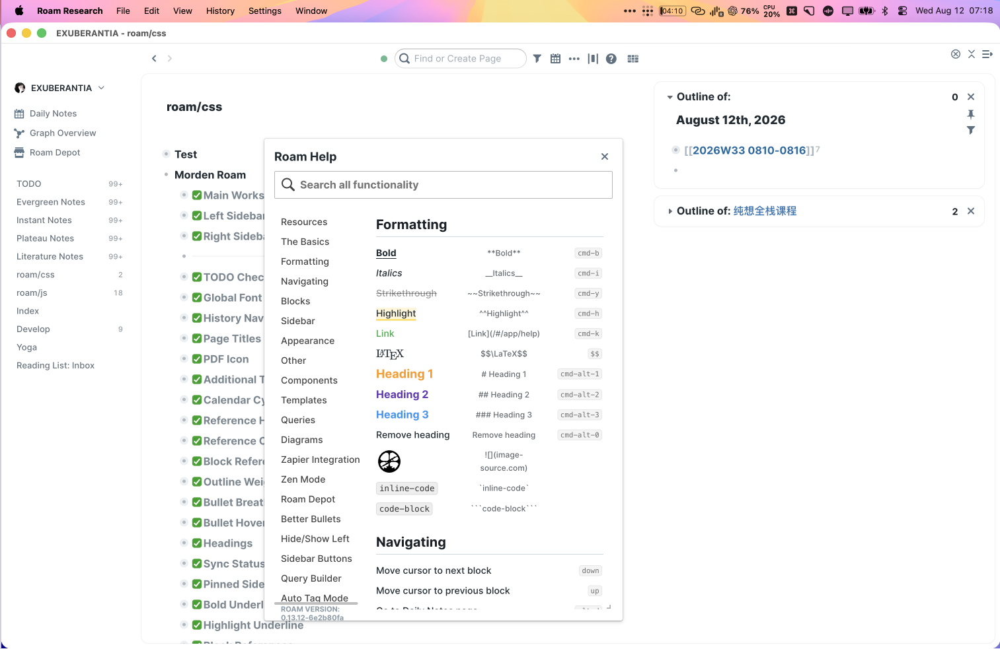

# Morden Roam CSS

A quiet, Linear-inspired visual layer for Roam Research. It brings the main workspace and sidebars into one coherent writing surface while preserving Roam's native block interactions.

Designed for long-form writing, block navigation, Daily Notes, and side-by-side research.



## Highlights

- A unified, softly rounded workspace shell with restrained borders and shadows
- Compact left navigation that preserves native starring and drag-and-drop behavior
- Inset right-sidebar cards with stable sizing, spacing, and scrolling
- Refined checkboxes, outline rails, references, tag badges, headings, and typography
- Optional JavaScript helpers for history navigation, sidebar reference counts, and consistent scrollbars

## Install

1. Copy [`roam.css`](./roam.css) into a CSS code block on your `roam/css` page.
2. Optionally copy [`roam.js`](./roam.js) into one enabled `{{[[roam/js]]}}` code block on your `roam/js` page.

The JavaScript bundle contains History Navigation Helper, Left Sidebar Reference Counts, and Roam Scroll in their original Roam order.

[`roam-history-availability.js`](./roam-history-availability.js) is retained for users who only need the standalone history-button helper. Do not run it together with the same module inside `roam.js`.

## Version

[`v1.0.0`](https://github.com/404KSG/morden-roam-css/releases/tag/v1.0.0) is the frozen stable baseline. The `main` branch follows the current active Roam setup and presently contains 35 CSS modules.

## Export from Roam

With the official Roam CLI configured:

```bash
node scripts/export-theme.mjs \
  --graph YOUR_GRAPH \
  --uid YOUR_THEME_BLOCK_UID \
  --output roam.css

node scripts/export-javascript.mjs \
  --graph YOUR_GRAPH \
  --uid YOUR_JS_ROOT_UID \
  --output roam.js
```

Both exporters are read-only. They preserve the active module order and do not modify the graph.
