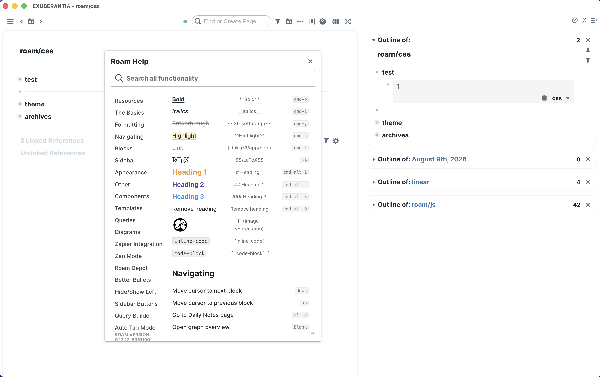

# Morden Roam CSS

A personal Roam Research theme focused on clear writing, strong block hierarchy, and quiet Linear-inspired surfaces.

This repository preserves the current working theme as one reproducible stylesheet. It includes the main workspace, sidebars, typography, checkboxes, block references, bullets, editor details, and Zettelkasten tag styles.

## Preview

The theme uses a minimal, Linear-inspired visual language for Roam's writing surface, navigation, and help UI.



## Use

Copy the contents of [`roam.css`](./roam.css) into a CSS code block on your `roam/css` page.

The current release contains 34 active CSS modules in the same order as the source graph. Keeping the order intact preserves the current cascade and appearance.

## Export again

With the official Roam CLI configured:

```bash
node scripts/export-theme.mjs \
  --graph YOUR_GRAPH \
  --uid YOUR_THEME_BLOCK_UID \
  --output roam.css
```

The exporter reads Roam only. It does not modify the graph.
