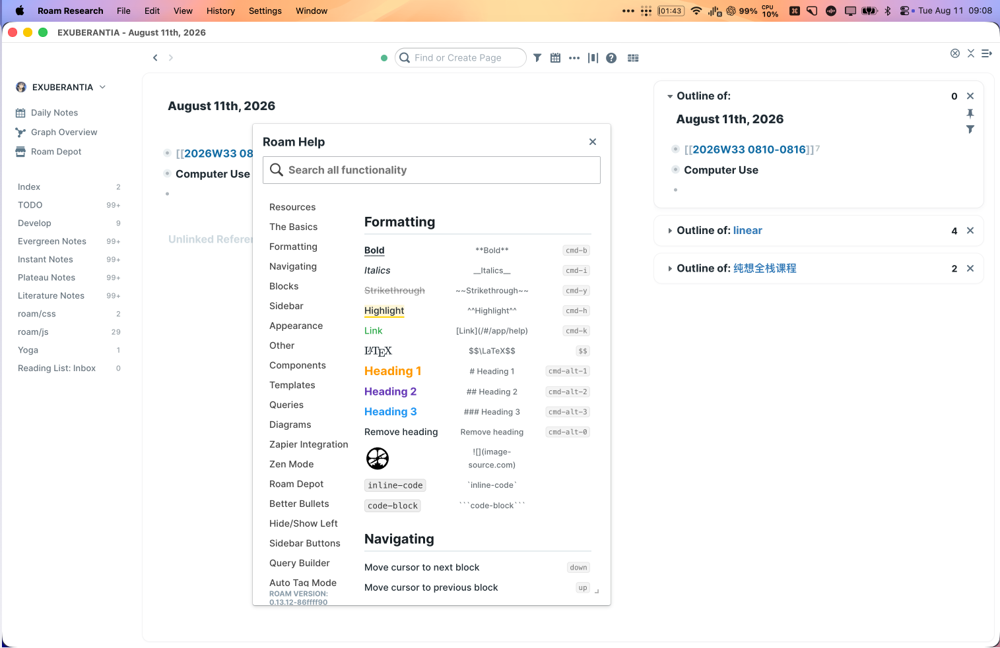

# Morden Roam CSS

A quiet, Linear-inspired Roam Research theme for writing, block navigation, and long-form work.

**Stable baseline: v1.0.0.** This release captures the current complete CSS and JavaScript setup.

## Preview

The current design combines a shared workspace shell, compact left navigation, inset right-sidebar cards, and restrained Roam-native typography.



## Install

Copy the contents of [`roam.css`](./roam.css) into a CSS code block on your `roam/css` page.

For the complete behavior bundle, copy [`roam.js`](./roam.js) into one enabled `{{[[roam/js]]}}` code block on your `roam/js` page. It contains History Navigation Helper, Left Sidebar Reference Counts, and Roam Scroll in their Roam order.

[`roam-history-availability.js`](./roam-history-availability.js) is retained as a standalone compatibility helper for users who only need history-button availability. Do not run it alongside the same module inside `roam.js`.

The exported stylesheet preserves all 35 active modules in their original Roam order.

## Export again

With the official Roam CLI configured:

```bash
node scripts/export-theme.mjs \
  --graph YOUR_GRAPH \
  --uid YOUR_THEME_BLOCK_UID \
  --output roam.css

node scripts/export-javascript.mjs \
  --graph YOUR_GRAPH \
  --uid YOUR_JS_ROOT_UID \
  --output roam.js
```

Both exporters read Roam only. They do not modify the graph.
